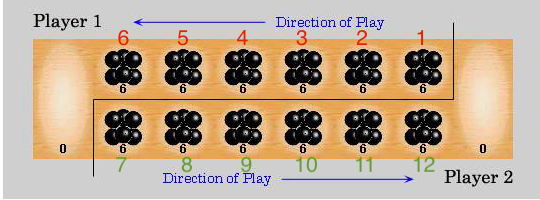

# Mancala game

This project implements an API service to play [Mancala](https://en.wikipedia.org/wiki/Mancala), which is a board game
played by 2 players.
The objective is to capture more stones in the big pit than your opponent.

## Technologies used

- Java 11
- Spring Boot 2.6.7
- Swagger 3.0.0
- JUnit 5

## Requirements

For building and running the application:

- [JDK 11](https://www.oracle.com/java/technologies/downloads/#java11)
- [Maven 3+](https://maven.apache.org)

## Usage

It is possible to run the application directly from the IDE, or using the Spring Boot Maven plugin:

    mvn spring-boot:run

## Description

The project cover the back-end part of the Mangala game. It contains a REST API that allows you to:

- start the game
- select pits to make the movements
- check who is the next player to move
- check the current status of the game

In order to select the pit for the movement, take into account that the application takes the following numbering:

So numbers from 1 to 6 (in red) belong to player 1. And numbers from 7 to 12 (in green) belong to player 2.

The default number of pits per player is 6 as well as the default number of initial stones per pit.
This is set in the `application.yaml` file, it is possible to change it, keeping in mind that the first half of the pits
will correspond to player 1 pits and the second half to player 2 pits.

## Improvements

- Include a database to store the game, allowing to save the status, multiplayer game... - Using @Entity and @Repository
- Include user management and authentication/authorization, to only allow known players to play the game - Spring
  Security
- Include a front-end application to consume the API methods making it more user-friendly